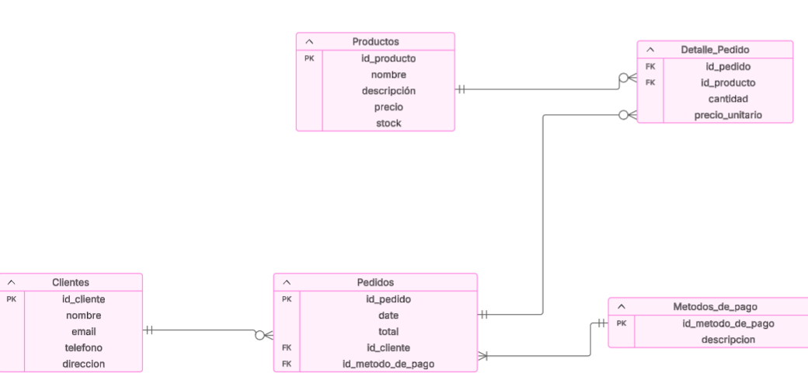

# Evaluación de portafolio

# PUNTO 1:
# Componentes básicos de una base de datos relacional

## **Tablas**
- Son estructuras que almacenan los datos organizados en **filas** y **columnas**.
- Cada tabla representa una **entidad** (por ejemplo, `Clientes` o `Pedidos`).

## **Registros (Filas)**
- Cada **fila** contiene un conjunto de datos relacionados que representan una **instancia de la entidad**.
- **Ejemplo:** En la tabla `Clientes`, un registro podría ser: Juan Pérez, juan@mail.com

## **Campos (Columnas)**
- Cada **columna** representa un **atributo** de la entidad.
- **Ejemplo:** En `Clientes`, los campos podrían ser: id_cliente, nombre, email

## **Clave primaria (PK – Primary Key)**
- Es un **campo (o conjunto de campos)** que **identifica de forma única** cada registro en la tabla.
- **Ejemplo:** `id_cliente` en la tabla `Clientes`.

## **Clave foránea (FK – Foreign Key)**
- Es un campo que **establece una relación** entre dos tablas, apuntando a la **clave primaria de otra tabla**.
- **Ejemplo:** En la tabla `Pedidos`, el campo `id_cliente` es una clave foránea que hace referencia a `Clientes(id_cliente)`.

# **Gestión y almacenamiento de datos**
- Cada tabla almacena los datos de forma estructurada, con cada **fila representando una instancia**.
- Las **relaciones entre tablas** se logran mediante las **claves primarias y foráneas**, evitando duplicar información.
- Este modelo facilita operaciones como **búsquedas, actualizaciones o eliminación de datos**, manteniendo la **integridad referencial**.

### Breve ejemplo en archivo punto1.sql

# PUNTO 2:
# Consultas SQL sobre el modelo de datos

### Desarrollo en archivo punto2.sql

# PUNTO 3:
# Manipulación de datos con SQL (DML)
## El Lenguaje de Manipulación de Datos (DML) permite **agregar, modificar y eliminar** registros en las tablas de la base de datos. A continuación, se presentan ejemplos aplicados al modelo `Clientes` y `Pedidos`.

### Desarrollo en archivo punto3.sql

# PUNTO 5:
# Diagrama entidad-relación (ERD) para representar la estructura básica de una tienda online. Incluye las entidades esenciales para gestionar productos, clientes, pedidos y métodos de pago, y sus relaciones.

## Entidades y atributos

### **1. Clientes**
- `id_cliente` (PK)
- `nombre`
- `email`
- `telefono`
- `direccion`

### **2. Productos**
- `id_producto` (PK)
- `nombre`
- `descripcion`
- `precio`
- `stock`

### **3. Pedidos**
- `id_pedido` (PK)
- `fecha`
- `total`
- `id_cliente` (FK)
- `id_metodo_pago` (FK)

### **4. Métodos de Pago**
- `id_metodo_pago` (PK)
- `descripcion`

### **5. Detalle_Pedido**
- `id_pedido` (FK)
- `id_producto` (FK)
- `cantidad`
- `precio_unitario`

## Relaciones

- Un **cliente** puede realizar muchos **pedidos** → Relación 1:N
- Un **pedido** está asociado a un solo **cliente**
- Un **pedido** puede tener muchos **productos** y un producto puede estar en muchos pedidos → Relación N:M mediante `Detalle_Pedido`
- Un **pedido** utiliza un solo **método de pago**, pero un método de pago puede ser usado en muchos pedidos → Relación 1:N

